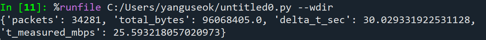
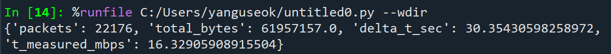
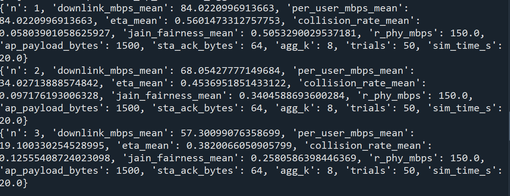

# multi-user-wifi-throughput-gap-analysis
다중 사용자 환경에서 Wi-Fi의 이론적 처리량과 실제 측정 처리량 간의 성능 격차를 계층적으로 분석한다.

본 연구는 Shannon 상한, PHY 기반 상한, MAC 시뮬레이션, 실제 측정 결과를 단계적으로 비교하여 Wi-Fi 처리량 감소의 구조적 원인을 규명하는 것을 목표로 한다.

## Motivation
- 실제 Wi-Fi 환경에서는 다수의 사용자가 동시에 접속한다.
- 사용자 수가 증가할수록 체감 처리량은 감소한다.
- 그러나 이 감소가 어느 계층에서 발생하는지 명확히 분리되지 않는다.

본 프로젝트는 다음과 같은 계층적 비교를 수행한다:

Shannon Capacity → PHY Upper Bound → MAC Simulation → Measurement

이를 통해 Wi-Fi 성능 저하의 구조적 원인을 단계적으로 분석한다.

  
## Overview
- 단일 사용자 환경과 다중 사용자 환경에서의 Wi-Fi 처리량을 비교 분석한다.
- Shannon capacity 및 PHY link rate를 기반으로 이론적 상한을 정의한다.
- 실제 패킷 캡처 데이터를 활용하여 측정 처리량을 산출하고, 이론값과의 차이를 정량적으로 평가한다.
- 채널 경쟁, 프로토콜 오버헤드, 재전송 등의 요인이 처리량 감소에 미치는 영향을 분석한다.

---

## Theoretical Model

- 이상적인 무선 채널 환경에서 달성 가능한 최대 전송률은 Shannon capacity로 표현된다.

$$
C = B \log_2(1 + SNR)
$$

여기서 **C**는 채널 용량(Channel Capacity), **B**는 채널 대역폭(Bandwidth), **SNR**은 신호 대 잡음비(Signal-to-Noise Ratio, S/N)를 의미한다.

이 값은 물리 계층에서 달성 가능한 정보이론적 상한이며, 실제 Wi-Fi 프로토콜 오버헤드나 채널 경쟁은 고려하지 않는다.

- 이상적인 다중 사용자 환경에서 한 사용자가 이론적으로 달성 가능한 최대 전송률은 다음과 같이 정의된다.

$$
T_{\text{ideal,shannon}} = \frac{C}{N}
$$

이는 정보이론적 상한을 사용자 수로 나눈 값으로, 현실적인 무선 환경에서는 직접적으로 달성되기 어렵다.

Shannon capacity는 정보이론적 상한이며, 실제 Wi-Fi 시스템에서는 변조 및 프로토콜 제약으로 인해 해당 값에 직접 도달할 수 없다. 따라서 본 연구에서는 실험 환경에서 관측된 PHY link rate를 실용적 비교 상한으로 사용한다.

---

## Measurement Model

- 실제 처리량은 PCAP 기반 패킷 캡처 데이터에서 측정 구간 $\Delta t$ 동안 관측된 프레임 길이의 합을 이용해 계산한다.

$$
T_{\text{measured}}=\frac{\sum(\text{frame.len}\times 8)}{\Delta t}
$$

여기서 `frame.len`은 MAC 및 상위 계층 헤더를 포함한 전체 프레임 길이를 의미한다.

---

## Simulation Model (DCF + Aggregation 기반)

본 연구에서는 실제 Wi-Fi 동작을 근사하기 위해  
DCF 기반 매체 접근 방식과 A-MPDU aggregation을 반영한 시뮬레이션을 수행하였다.

- PHY rate: 150 Mbps
- Aggregation factor: k = 8
- Hidden node 및 채널 에러는 고려하지 않음
- STA uplink ACK는 트리거 기반 모델 사용

---

## GAP 정의

본 연구에서 성능 격차는 다음과 같이 정의한다.

$$
G = T_{\text{ideal,phy}} - T_{\text{measured}}
$$

또한, PHY 기반 이론 상한 대비 실제 효율은 다음과 같이 정의한다.

$$
\eta = \frac{T_{\text{measured}}}{T_{\text{ideal,phy}}}
$$

---

## Theoretical Experiment (PHY 기반 상한)

본 연구에서는 수신 링크 속도(135 Mbps)를 실험 비교를 위한 실용적 이론 상한으로 사용한다.

$$
T_{\text{ideal,phy}} = \frac{R_{\text{phy}}}{N}
$$

### Case 1 (N = 1)
$$
T_{\text{ideal,phy}} = 150 \text{ Mbps}
$$

### Case 2 (N = 2)
$$
T_{\text{ideal,phy}} = 75 \text{ Mbps}
$$

### Case 3 (N = 3)
$$
T_{\text{ideal,phy}} = 50 \text{ Mbps}
$$

---

## Measured Experiment (Speedtest 기반)

### N = 1

### N = 2

### N = 3

| N | Measured (Mbps) | Efficiency (η) |
|---|------------------|----------------|
| 1 | 57.03 | 0.38 |
| 2 | 25.59 | 0.34 |
| 3 | 16.33 | 0.32 |

---

## Simulation Result

| N | Simulation (Mbps) | Efficiency (η) |
|---|--------------------|----------------|
| 1 | 84 | 0.56 |
| 2 | 34 | 0.45 |
| 3 | 19 | 0.38 |

시뮬레이션 결과는 Shannon 기반 이론 상한과 실제 측정값 사이의 중간 수준을 보이며,  
MAC 계층 경쟁과 프로토콜 오버헤드 효과를 반영함을 확인할 수 있다.

- N=1일 때 84Mb, N=2일 때 34Mb, N=3일 때 19Mb의 차이가 발생하는 것을 확인할 수 있다.

---

## Gap Analysis

### Theoretical → Simulation 

| N | Gap (Mbps) |
|---|------------|
| 1 | 66 |
| 2 | 41 |
| 3 | 31 |

원인:
- CSMA/CA 경쟁
- Backoff
- MAC/ACK 오버헤드
- Half-duplex 특성

---

### Simulation → Measurement 

| N | Gap (Mbps) |
|---|------------|
| 1 | 26.97 |
| 2 | 8.41 |
| 3 | 2.67 |

원인:
- TCP 혼잡 제어
- 실제 채널 간섭
- 드라이버 정책
- Background traffic

---

## 처리량 저하의 구조적 원인

이론적 상한과 실제 처리량 사이의 격차는 Wi-Fi의 구조적 특성에 의해 발생한다.

### 1. MAC 계층 경쟁 (CSMA/CA)
Wi-Fi는 CSMA/CA 기반으로 동작하므로 한 시점에 하나의 장치만 전송이 가능하다.  
사용자 수가 증가할수록 백오프 시간과 충돌 확률이 증가하여 효율이 감소한다.

### 2. 프로토콜 오버헤드
PHY 링크 속도는 실제 데이터만을 의미하지 않는다.  
MAC 헤더, TCP/IP 헤더, ACK 프레임, Inter-frame space 등이 포함되어 유효 데이터 전송 비율이 감소한다.

### 3. Half-duplex 특성
Wi-Fi는 반이중(half-duplex) 통신이므로 송수신을 동시에 수행할 수 없다.  
이는 유선(full-duplex) 환경 대비 구조적으로 낮은 효율을 초래한다.

### 4. TCP 혼잡 제어
Speedtest는 TCP 기반이므로 Slow Start, Congestion Window 조절 등의 영향으로 실제 전송률이 PHY 속도보다 낮게 나타난다.

---

## Conclusion
본 연구는 다중 사용자 환경에서 Wi-Fi 처리량 감소가 단순한 사용자 수 증가의 결과가 아니라,

1. MAC 계층 경쟁 구조  
2. 프로토콜 오버헤드  
3. Half-duplex 특성  
4. TCP 혼잡 제어  

에 의해 단계적으로 발생함을 정량적으로 확인하였다.

Shannon → PHY → Simulation → Measurement의 계층적 비교를 통해 Wi-Fi 성능 격차를 구조적으로 분해할 수 있음을 보였다.

실험 결과, 실제 처리량은 PHY 기반 이론 상한 대비 약 32%~38% 수준으로 나타났으며, 사용자 수 증가에 따라 효율이 점진적으로 감소하는 경향을 확인하였다.