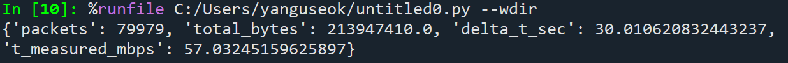

# multi-user-wifi-throughput-gap-analysis
- 다중 사용자 환경에서 Wi-Fi의 이론적 처리량과 실제 측정 처리량 간의 성능 격차를 정량적으로 분석하고, 그 원인을 이론적 모델과 실험 데이터를 기반으로 규명한다.

## Motivation
- 실제로 한 Wi-Fi에는 여러 사용자가 접속하여 인터넷에 연결하는 경우가 많으며 한 기기만 연결하는 일은 드물다.
- 그러나 여러 기기를 연결할수록 사용자가 체감하는 처리량은 감소하며 한 기기만을 사용했을 때와의 성능 차이가 발생한다.
- 본 프로젝트는 이론적 처리량과 실제로 측정된 처리량 간의 성능 격차를 통신 계층 관점에서 분석하고 그 원인을 규명하는 것을 목표로 한다.
  
## Overview
- 단일 사용자 환경과 다중 사용자 환경에서의 Wi-Fi 처리량을 비교 분석한다.
- Shannon capacity 및 PHY link rate를 기반으로 이론적 상한을 정의한다.
- 실제 패킷 캡처 데이터를 활용하여 측정 처리량을 산출하고, 이론값과의 차이를 정량적으로 평가한다.
- 채널 경쟁, 프로토콜 오버헤드, 재전송 등의 요인이 처리량 감소에 미치는 영향을 분석한다.
- 성능 격차를 줄이기 위한 가능한 개선 방안을 검토하고 개선 전략 적용 전후의 처리량을 비교하여 성능 격차 감소 여부를 검증한다.

## Theoretical Model
- 이상적인 무선 채널 환경에서 달성 가능한 최대 전송률은 Shannon capacity로 표현된다.

$$
C = B \log_2(1 + SNR)
$$

여기서 **C**는 채널 용량(Channel Capacity), **B**는 채널 대역폭(Bandwidth), **SNR**은 신호 대 잡음비(Signal-to-Noise Ratio, S/N)를 의미한다.

이 값은 물리 계층(Physical Layer)에서 달성 가능한 이론적 상한을 나타내며, 채널 경쟁, 재전송, 프로토콜 오버헤드 등은 고려하지 않은 이상적인 조건을 가정한다.

- 이상적인 다중 사용자 환경에서 한 사용자가 이론적으로 달성 가능한 최대 전송률은 다음과 같이 정의된다.

$$
T_{\text{ideal,shannon}} = \frac{C}{N}
$$

여기서 T(ideal,shannon)는 이상적인 다중 사용자 처리량, **C**는 채널 용량(Channel Capacity), **N**은 사용자수(Users)

이 값은 채널 용량을 사용자 수를 나눈 값으로써 한 사용자가 사용할 수 있는 이상적인 처리량의 값을 의미한다.

## Measurement Model
- 실제 처리량은 PCAP 기반 패킷 캡처 데이터에서 측정 구간 $\Delta t$ 동안 관측된 프레임 길이의 합을 이용해 계산한다.

$$
T_{\text{measured}}=\frac{\sum(\text{frame.len}\times 8)}{\Delta t}
$$

여기서 T(measured)는 실제 측정된 처리량, $\Delta t$ 는 측정 구간(초), `frame.len`은 각 프레임의 전체 길이(Byte)이며 MAC 헤더 및 상위 계층 헤더를 포함한다.

## Measurement Pipeline
- Wireshark/tshark로 트래픽을 캡처하여 PCAP로 저장한다.
- Python으로 PCAP를 파싱해 `frame.len` 합과 측정 구간 $\Delta t$를 계산한다.
- 구간별 처리량을 산출하고 통계/시각화를 수행한다.

## GAP
- 이상적 처리량과 실제 측정 처리량 간의 성능 격차는 다음과 같이 정의된다.

$$
G=T_{\text{ideal,phy}}-T_{\text{measured}}
$$

여기서 **G**는 이론 상한과 실제 측정 처리량간의 성능 격차, T(ideal,phy)는 PHY 기반 이상적 처리량, T(measured)는 실제 측정된 처리량을 의미한다.

## Theoretical Experiment
- 이상적 처리량은 다음과 같다.

- Receive link rate: 135 Mbps  
- Transmit link rate: 300 Mbps  
- Band: 2.4 GHz (802.11n)

본 연구에서는 수신 링크 속도(135 Mbps)를 실험 비교를 위한 실용적 이론 상한으로 사용한다.

$$
T_{\text{ideal,phy}} = \frac{R_{\text{phy}}}{N}
$$

### Case 1 (N = 1)

$$
T_{\text{ideal,phy}} = \frac{135}{1} = 135\ \text{Mbps}
$$

### Case 2 (N = 2)

$$
T_{\text{ideal,phy}} = \frac{135}{2} = 67.5\ \text{Mbps}
$$

### Case 3 (N = 3)

$$
T_{\text{ideal,phy}} = \frac{135}{3} = 45\ \text{Mbps}
$$

- 사용자 수가 증가할수록 이상적 1인당 처리량은 N에 반비례하여 감소한다.
- 본 값은 PHY 계층의 최대 전송 속도를 기반으로 한 상한이며, MAC 오버헤드, 재전송, 채널 경쟁 등은 고려하지 않는다.

## Measured Experiment

### Measured Throughput (N=1, Speedtest)

### Measured Throughput (N=2, Speedtest)

